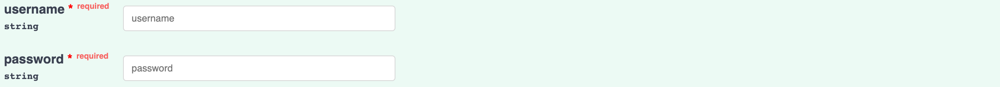

### Accounts

This action creates an account tied to a specific user and stores it within the database.

<details>
<summary><strong>JSON Request Body:</strong></summary>
<br>

```
    {
        "first_name": "string",
        "last_name": "string",
        "username": "string",
        "hashed_password": "string",
        "email": "string",
        "is_chef": true
    }
```
</details>
<details>

<summary><strong>Returns (Status Code 200):</strong></summary>
<br>

```
    {
        "access_token": "string",
        "token_type": "Bearer",
        "account": {
            "id": "string",
            "first_name": "string",
            "last_name": "string",
            "username": "string",
            "email": "string",
            "is_chef": true
        }
        }
```
</details>


This action logs an existing user into the application.

Request Body:

